<div align="center">
  <h1>Hello there! 😄</h1>
  <p>My name is <b>Tiago Silva</b><p>
  <p>I am a hobbist programmer that likes to code just because I usually have nothing to do, want to make something useful to help others, or if @Ndymario bugs me to code something.</b><p>
  <!-- Ndy was here! You most be some sort of goof if you're snooping around in here :p /!-->
  Discord: @thegameratort
</div>
<br>
<div align="center">
  <a href="https://github.com/marketplace/actions/github-readme-stats-action"></a>
  <a href="https://github.com/marketplace/actions/github-readme-stats-action"></a>
</div>
<br>

<div align="center">
<p>A snippet of code for you to try out. 😉</p>
</div>

```cpp
#include <iostream>
#include <cstring>

static const char* input = "XQXQ,&),Ve^Y,^e]RUb,Rbbbbb";

int main() {
    size_t input_size = strlen(input);
    char* output = new char[input_size];
    for (size_t i = 0; i < input_size; i++) {
        char c = input[i];
        if (c == 0x2C) {
            output[i] = static_cast<char>(0x20);
        } else {
            output[i] = static_cast<char>(c + 0x10);
        }
    }
    std::cout << output;
    delete[] output;
    return 0;
}
```

<div align="center">
<h3>What are you doing here!!!???? 😳😳😳</h3>
</div>
