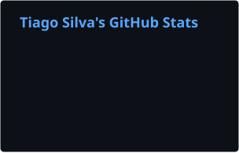
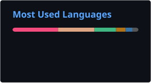

<div align="center">
  <h1>Hello there! 😄</h1>
  <p>My name is <b>Tiago Silva</b> and I am a computer engineer!<p>
  <p>I code, love music and I'm currently learning both drawing and Japanese.<p>
  <p>The programs I write for myself often end up shared with everyone, or if <b>@Ndymario</b> bugs me to code something.</b><p>
  <!-- Ndy was here! You most be some sort of goof if you're snooping around in here :p /!-->
  Discord: @thegameratort
</div>
<br>
<div align="center">
  <a href="https://github.com/marketplace/actions/github-readme-stats-action"></a>
  <a href="https://github.com/marketplace/actions/github-readme-stats-action"></a>
</div>
<br>

<div align="center">
<p>A snippet of code for you~ ❤️</p>
</div>

```cpp
#include <iostream>

const char secret[] = "H^d,bW^d[S,_Xbb,h^dabT[U,=>F-";

int main() {
    for (const char* c = secret; *c != 0; c++) {
        std::cout << static_cast<char>(// C++ !
            (*c == 0x2C || *c == 0x2D) ?
                *c - 0xC :
                *c + 0x11);
    }
}
```
